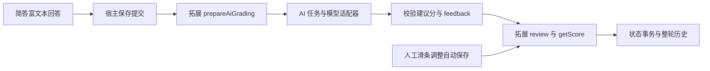

# 核心源码与简答 AI 评分

核心代码、依赖、构建产物和开发资料集中在 `core/`，题库、拓展、技能、启动入口与 README 保持产品根层。下文路径均相对于产品根目录；服务 `--root` 仍指向产品根目录，对外协议保持稳定。

| 职责 | 主要源码 | 边界 |
| --- | --- | --- |
| 启动、HTTP、局域网鉴权 | `Main.java`、`QuizForgeServer.java` | 监听器、Host/Origin、密码、请求体与响应限制 |
| 题库和题目路由 | `CollectionRoutes.java` | 将请求交给对应业务服务，不绕过统一写入检查 |
| 题库和拓展包 | `Library.java` | 扫描、版本绑定、校验、页面资源和编辑计划 |
| 更新兼容契约 | `ExtensionApi.java` | API v1.0／v1.1／v1.2、Manifest 需求和题库格式校验；缺省旧声明，页面/历史按各自运行版本加载 |
| 混合题型批处理 | `RuleBatches.java` | 按拓展 ID／版本／签名分组，顺序有界分块，结果恢复原题序 |
| 作答与历史事务 | `StateStore.java`、`HistoryRounds.java`、`EditJournal.java` | 修订号、幂等回执、保存、历史冻结、恢复；事务继续集中在状态仓库 |
| 通用 AI 任务 | `AiGradingService.java`、`AiGradingProtocol.java` | 排队、重试、结果校验、过期检查、自动保存评分，以及最终反馈 |
| 模型通信 | `AiSettings.java`、`AiGateway.java`、`AiProvider.java`、`OpenAiCompatibleProvider.java` | 设置与密钥、模型协议适配、输入输出预算 |
| 浏览器协调 | `core/web/app.js` | 标签、页面生命周期、保存屏障、草稿、编辑和历史切换 |
| 题型请求与视图上下文 | `core/web/extension-requests.js`、`core/web/practice-context.js`、`core/web/extension-pages.js` | 请求分发、读写权限、导航、题目级拓展页面路由与缓存归属 |
| 拓展沙箱与 AI 桥接 | `core/web/frame.js`、`core/web/ai-client.js` | 会话来源校验、SDK、请求去重、评分保存后更新宿主状态 |
| 简答业务 | `extensions/基础题型/short-answer-1.3.0/` | 统一题干、两级富文本编辑、AI 评分输入、默认零分、0.5 分滑条自动保存；使用应用提供的富文本接口，旧版包位于兼容测试 fixture |
| 简答评分迁移 | `ShortAnswerAutoUpgrade.java`、`Library.java`、`StateStore.java` | 显式 1.2.2 → 1.3.0，保持题目内容、现有正式成绩及完成状态，备份原题库/状态，沿用恢复事务 |

Java 文件均位于 `core/src/main/java/io/quizforge/web/`；共享组件位于 `core/shared/richtext/`。题型自己的题干、参考答案、评分说明和判分规则留在根层 `extensions/` 中；分值汇总、历史、模型设置和密钥由应用负责。

普通题库与正式/runtime 样例的根 `features` 控制整库编辑、白板及历史含练习持久化，省略项默认 true。history=false 的答案、分数、白板、完成状态、练习图片和 AI 任务仅在当前浏览器页面会话中有效；刷新或关闭浏览器标签后不能恢复，editing=true 仍允许保存题目文件和编辑图片。样例编辑只维护 examples 和样例图片，不修改 manifest、规则、Schema、页面或 SDK 等版本代码，也不改变其他题库的代码身份；旧历史仍冻结。具体规则见 [题库格式](QUESTION_BANK_FORMAT.md#整库功能开关) 与 [兼容政策](COMPATIBILITY.md)。下文持久保存与恢复描述适用于历史开启的集合。

当前安装的单选和简答位于 `extensions/基础题型/{single-choice,short-answer-1.3.0}`，保持各自原 ID/版本；`kaoyan-english-2026-dev` 和 `ui-preview-dev` 是独立开发叶。物理分组无清单、身份或共同版本，见 [分组规则](EXTENSION_GROUPS.md)。旧简答包保留在 `core/test/fixtures/legacy-extensions/`，重复的旧 AI 简答示例题库保留在 `core/test/fixtures/legacy-banks/`，不参与正常目录扫描；用户自行安装的旧版本仍遵循既有兼容政策。

题库允许每题绑定不同拓展或同一拓展的不同版本；旧根级绑定保持原状态标识。混合历史保存去重的 `pages` 表和每题 `pageKey`，历史读取只使用当时的投影与页面。拓展集合及其内容签名在加载集合时计算一次，暖缓存检查不重复生成混合拓展签名。浏览器继续只保留一个活动题型页面。



## 原简答题库升级

正常启动不传入 `--upgrade-short-answer`，不改题库的拓展绑定。只有用户显式运行根层 `.\Start-QuizForge-Web.cmd -UpgradeShortAnswer`（或自行传 Java 开关 `--upgrade-short-answer`），才将已安装的 `quizforge.short-answer` 1.0.0／1.1.0／1.2.0／1.2.1 升级到 1.2.2，支持根级单拓展和题目级混合绑定。该操作会修改旧题库，执行前先保存、关闭原服务并备份整个产品目录。脚本在检测到同根服务运行或另一个启动窗口占用目录时拒绝升级，不复用当前服务。升级在新服务开始接受请求之前进行；不要让不同端口的服务同时使用同一份数据目录。

这条旧版迁移要求所需旧包与 1.2.2 目标包实际安装到 `extensions/`；测试 fixture 不作为安装包。当前随附简答题库已绑定 1.3.0，不需要执行。

富文本公共接口与实现分离：`RichTextService.java` 读取 `shared/richtext/service.json`，为新 `requiresRichText` 与已知旧依赖选择兼容实现；`QF.content` 是宿主公开的服务门面，拓展无需直接使用 Tiptap。当前高级文档约定使用组件 1.1.2，基础约定保留 1.0.0；普通更新不修改拓展或题库绑定。页面资源版本包含实现选择，题目/作答/草稿身份不包含实现版本。历史冻结实际选择，读取 `.state/sdk/` 中固定组件及原页面；不会按当前配置替换旧历史。详见 [富文本服务](RICHTEXT_SERVICE.md)。

升级保持题库 ID、题目 ID、原题干和图片；1.0.0／1.1.0 的旧独立题名作为题干开头的二级标题保留，已有相同开头时不重复添加，1.2.0／1.2.1 的题干不再追加题名。通用题目元数据仍保留 title，新简答编辑器从题干生成该字段。根级单拓展绑定使用独立状态文件与新的修订号，旧版 `.state` 文件不变；题目级绑定的状态标识仍为 `bank:<id>:mixed`，即使只有一种题型也沿用该标识。升级先将原题库和状态字节备份到 `.state/upgrade-backups/`，再通过已有编辑事务更新同一状态文件。进行中轮次保留其他题型的答案、结果与修订号；已完成轮次的全部答案转为草稿，清空当前结果并增加修订号。历史中的题目、页面、答案和评分内容保持原样，旧进行中轮标记中断并记录关闭时间，已完成历史保持冻结。旧写入回执不会套用到新版本。

- 进行中的练习：答案、当前评分和白板带入新版本，已提交题建立 AI 版的进行中轮次；此前的旧轮次仍可只读查看。
- 已完成的练习：原轮次成绩冻结，保存的答案作为新一轮草稿恢复，再提交后可请求 AI 评分。
- 单题型已存在目标版本练习状态时拒绝覆盖；待升级题存在未保存编辑草稿、题目签名不匹配、数据损坏或校验失败时保留旧数据并报告错误。编辑草稿须先保存或取消再升级。

题库引用与新状态使用已有编辑恢复日志逐库共同提交，日志落盘后的中断会向前恢复；多个题库并非一次整体事务。备份写入失败或目录冲突时安全拒绝。再次启动会跳过已升级题库。此规则针对已知兼容的简答版本，不是任意拓展的自动迁移机制。

## 简答自动保存评分升级

可显式执行一次性迁移，将现有题库中 `quizforge.short-answer` 的精确绑定 1.2.2 迁移到已安装的 1.3.0。此路径由 `ShortAnswerAutoUpgrade` 调用 `Library.prepareShortAnswerAutoUpgrade` 和 `StateStore.upgradeShortAnswerAuto`；与上面的旧版 → 1.2.2 升级分别实现，不能套用其“完成答案转草稿”行为。新版提交保存默认 0 分，人工滑条按 0.5 分调整并自动保存，AI 校验成功后保存实际成绩。

迁移前确认 1.2.2 与 1.3.0 包都已安装；当前随附题库无需再迁移。

先保存或取消未完成编辑并关闭当前服务，从产品根目录执行：

```powershell
java -jar core/target/quizforge-web-1.0.0.jar --root . --port 8787 --upgrade-short-answer-auto --upgrade-only
```

Main 先绑定所选端口，再通过 `QuizForgeServer.upgradeShortAnswerAutoBanks()` 迁移；同端口已有服务时不会开始写入。`--upgrade-only` 完成后关闭并退出，不启动网页服务；随后用普通启动脚本开启。普通启动没有这个开关，不自动改变题库，执行迁移时也不要让其他端口的实例访问同一目录。

迁移只处理 1.2.2 → 1.3.0，不改变题目 data、title、outline、题库/题目 ID，也不修改其他题型绑定。原答案和白板保留；已有数值的正式成绩保留，已提交 pending 简答通过新规则转为正式 0 分。未提交答案保持原作答/草稿状态。已完成练习继续保持 finished，不重置成新草稿或重复添加旧完成记录；旧历史中的页面、题目、答案、评分与完成状态保持冻结。新版本作答使用更新的签名与修订号，旧写入回执和旧 AI 任务不能覆盖新状态。

每个题库事务提交前，将原始 bank/state 字节备份到 `.state/upgrade-backups/` 下的 `bank.json`、`state.json`。根级单拓展使用新的版本状态文件并保留旧状态，混合题库沿用现有状态标识。遇到待升级题未保存编辑草稿、单拓展目标版本已存在练习、签名或校验冲突时拒绝对应迁移，原题库、状态和编辑草稿保留。备份写入失败也不提交；题库与新状态沿用编辑恢复日志共同提交，多个题库逐库处理，不是一笔整体事务。重复执行跳过已升级题库，不重写旧包或冻结历史。

## 小题导航

题库每题的 `outline` 明确选择大题标签或小题列表，集合加载时校验并缓存；`getOutlineItems(data)` 仅为未配置的文件提供目录。`OutlineItems` 校验显式互斥结构，`RuleBatches` 只对缺字段的题目运行生成钩子。`renderOutline` 按原题序和相邻父题型/版本展平为同一个编号矩阵，小题替换大题按钮，不留占位列；旧题库及历史也使用该布局。`outline-navigation.js` 在复用或打开父题后调用页面的 `onOutlineNavigate(itemId)`；历史从冻结集合读取标签和顺序。父题状态、内容指纹与评分结构不变。完整格式及接口见 [QUESTION_BANK_FORMAT.md](QUESTION_BANK_FORMAT.md) 和 [SUBQUESTION_OUTLINE.md](SUBQUESTION_OUTLINE.md)。

## API 与题库版本兼容

完整政策见 [COMPATIBILITY.md](COMPATIBILITY.md)。当前支持 API v1.0／v1.1／v1.2 与 bank 顶层格式 v1；Manifest 缺少 `requiresApi`、题库缺少 `formatVersion`、旧历史页缺少 `apiVersion` 时都按 v1 读取而不修改文件。显式不兼容声明在拓展规则执行前拒绝。页面与编辑页面携带 `apiVersion:{major:1,minor:2}`；历史保存各页面自己的版本。浏览器 `QF.api` 公布该运行版本与能力列表，操作权限仍由 context.capabilities 控制。题库/拓展内容签名继续遵守既有字节与数据规则，不能为添加新字段重建旧包。

## 开发版拓展

`DevelopmentSettings` 保存本机开发者模式开关，`DevelopmentExtensions` 读取显式 UI/runtime 标记、页面及本地资源。`Library` 分开解析正式包与开发包，测试题库须明确绑定开发目录；服务把开发作答、历史、编辑草稿、资源和 AI 任务路由到独立状态目录。UI 预览由 `development-preview.js` 加载，不注入 QF SDK；`development-watch.js` 只监测当前可见页面，写入未完成时保留上次可用画面。runtime 使用原有题型接口，发布前校验并复制为新的正式版本。使用方式和边界见 [DEVELOPMENT_EXTENSIONS.md](DEVELOPMENT_EXTENSIONS.md)。

## 开发与验证

构建命令在 `core/` 中执行。组件构建 `npm run build:richtext-advanced -- --version <新组件版本>`（基础为 `build:richtext`）只构建新组件目录并拒绝覆盖已发布输出，不重建拓展。题型规则变化才单独构建新拓展版本；旧简答构建与兼容验证使用 `core/test/fixtures/legacy-extensions/`，不能原地重建用户已发布内容。拓展列表按类型显示最新可预览版本；用户已安装的旧版本仍可供绑定它的题库和历史使用。`core/web/frame.js` 的 scoped `editor-layout` 消息只控制窗口布局，沿用同一 iframe；宿主通过 `setEditorLayout` 暂停相机更新并在退出时恢复。

定向验证入口：

```powershell
Push-Location .\core
node --test test/extension-requests.test.mjs test/ai-host.test.mjs test/short-answer-ai-*.test.mjs
mvn.cmd '-Dtest=ShortAnswerUpgradeTest,AiHttpTest,AiGradingServiceTest,ServerTest' test
Pop-Location
```

以上示例从产品根目录执行；测试结果与构建产物位于 `core/target/`。

真实模型连接需要用户在左下角设置中配置。自动测试和开发预览使用临时目录与模拟模型，不调用用户的付费模型。
