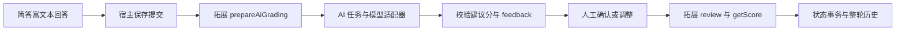

# 核心源码与简答 AI 评分

代码按职责拆分，运行目录和对外协议保持稳定。

| 职责 | 主要源码 | 边界 |
| --- | --- | --- |
| 启动、HTTP、局域网鉴权 | `Main.java`、`QuizForgeServer.java` | 监听器、Host/Origin、密码、请求体与响应限制 |
| 题库和题目路由 | `CollectionRoutes.java` | 将请求交给对应业务服务，不绕过统一写入检查 |
| 题库和拓展包 | `Library.java` | 扫描、版本绑定、校验、页面资源和编辑计划 |
| 混合题型批处理 | `RuleBatches.java` | 按拓展 ID／版本／签名分组，顺序有界分块，结果恢复原题序 |
| 作答与历史事务 | `StateStore.java`、`HistoryRounds.java`、`EditJournal.java` | 修订号、幂等回执、保存、历史冻结、恢复；事务继续集中在状态仓库 |
| 通用 AI 任务 | `AiGradingService.java`、`AiGradingProtocol.java` | 排队、重试、候选、过期检查、确认，以及最终反馈 |
| 模型通信 | `AiSettings.java`、`AiGateway.java`、`AiProvider.java`、`OpenAiCompatibleProvider.java` | 设置与密钥、模型协议适配、输入输出预算 |
| 浏览器协调 | `web/app.js` | 标签、页面生命周期、保存屏障、草稿、编辑和历史切换 |
| 题型请求与视图上下文 | `web/extension-requests.js`、`web/practice-context.js`、`web/extension-pages.js` | 请求分发、读写权限、导航、题目级拓展页面路由与缓存归属 |
| 拓展沙箱与 AI 桥接 | `web/frame.js`、`web/ai-client.js` | 会话来源校验、SDK、请求去重、确认后更新宿主状态 |
| 简答业务 | `extensions/short-answer-1.2.1/` | 统一题干、两级富文本编辑、AI 评分输入、0.5 分精度、人工确认；引用公共富文本 1.1.1，规则源码位于 `src/`，构建为 `rules.js` |

Java 文件均位于 `src/main/java/io/quizforge/web/`。题型自己的题干、参考答案、评分说明和判分规则留在拓展中；分值汇总、历史、模型设置和密钥由应用负责。

题库允许每题绑定不同拓展或同一拓展的不同版本；旧根级绑定保持原状态标识。混合历史保存去重的 `pages` 表和每题 `pageKey`，历史读取只使用当时的投影与页面。拓展集合及其内容签名在加载集合时计算一次，暖缓存检查不重复生成混合拓展签名。浏览器继续只保留一个活动题型页面。



## 原简答题库升级

正常启动脚本传入 `--upgrade-short-answer`，只升级已安装的 `quizforge.short-answer` 1.0.0／1.1.0／1.2.0 题库到 1.2.1。升级在服务开始接受请求之前进行；先关闭原服务再启动，不要让不同端口的服务同时使用同一份数据目录。

1.2.1 引用独立发布的富文本 SDK 1.1.1。旧版 SDK 优先解析 `.state/sdk/` 中已校验的固定快照；即使旧版源文件曾经同版本重建，也不会替换快照或阻止正常启动。历史仍读取原来的 SDK 和页面，新版使用新的快照目录。目录加载失败保留具体错误码和原因，升级失败会区分目标拓展缺失与目标资源无效。

升级保持题库 ID、题目 ID、原题干和图片；1.0.0／1.1.0 的旧独立题名作为题干开头的二级标题保留，已有相同开头时不重复添加，1.2.0 的题干不再追加题名。通用题目元数据仍保留 title，新简答编辑器从题干生成该字段。旧版拓展与旧版 `.state` 文件完整保留，历史按题库 ID 跨版本读取，旧快照不会改写。新版本使用独立状态文件与新的修订号，旧写入回执不会套用到新版本。

- 进行中的练习：答案、当前评分和白板带入新版本，已提交题建立 AI 版的进行中轮次；此前的旧轮次仍可只读查看。
- 已完成的练习：原轮次成绩冻结，保存的答案作为新一轮草稿恢复，再提交后可请求 AI 评分。
- 已存在 AI 版练习状态时拒绝覆盖；题目签名不匹配、数据损坏或校验失败时保留旧数据并报告错误。

题库引用与新状态使用已有编辑恢复日志共同提交，中断后向前恢复。再次启动会跳过已升级题库。此规则针对已知兼容的简答版本，不是任意拓展的自动迁移机制。

## 开发与验证

修改当前简答规则源码后执行 `npm run build:short-answer-advanced`；修改公共组件执行 `npm run build:richtext-advanced`。不要编辑已经发布的旧包。拓展列表按类型显示最新可预览版本；旧版本仍可供绑定它的题库和历史使用。`web/frame.js` 的 scoped `editor-layout` 消息只控制窗口布局，沿用同一 iframe；宿主通过 `setEditorLayout` 暂停相机更新并在退出时恢复。

定向验证入口：

```powershell
node --test test/extension-requests.test.mjs test/ai-host.test.mjs test/short-answer-ai-*.test.mjs
mvn.cmd '-Dtest=ShortAnswerUpgradeTest,AiHttpTest,AiGradingServiceTest,ServerTest' test
```

真实模型连接需要用户在左下角设置中配置。自动测试和开发预览使用临时目录与模拟模型，不调用用户的付费模型。
